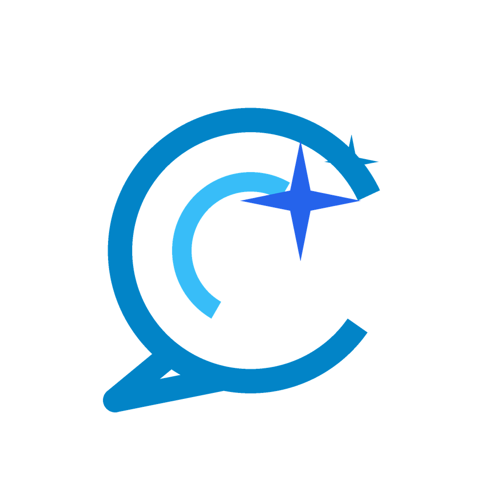

# 💎 SpeakUP AI • Master Brand Identity & Design System Kit
*(Multimillion-Dollar Silicon Valley Specification • Tier-1 Production Brand Kit)*

---

## 📖 1. The Brand Story Behind the Logo



### The Philosophy: *"Confidence Through Intelligent Conversation"*
For millions of ambitious Bangladeshi learners, candidates preparing for BCS Viva, and professionals seeking IELTS Band 8.0, the biggest barrier to English fluency is **speech hesitation and fear of judgment**.

The **SpeakUP AI** mark was designed to symbolize the exact moment hesitation transforms into effortless, natural fluency.

### Logo Symbolism & Anatomy:
1. **The Organic Speech Arc (Human Expression)**:
   The ergonomic sweeping outer arc represents warm, approachable 1-on-1 human conversation.
2. **The 4-Point AI Diamond Sparkle (Intelligence & Breakthrough)**:
   Nestled at the dynamic focal point is a radiant 4-point AI Star burst, representing Gemini AI illuminating word choices and grammar in real time.
3. **The Acoustic Resonance Curve (Voice & Rhythm)**:
   The inner sweeping soundwave curve mirrors pitch modulation, IPA phonetics, and speech rhythm.
4. **The Electric Cyan & Sky Blue Gradient (Precision & Trust)**:
   Shifting from Deep Space Navy (`#0F172A`) to Electric Cyan (`#38BDF8`) and Sky Blue (`#0284C7`), the palette signifies depth of knowledge and modern technological sophistication.

---

## 🎨 2. Master Color Palette & Design Tokens

```
+-----------------------------------------------------------------------+
|  ELECTRIC SKY BLUE    |  VIVID CYAN          |  DEEP SPACE NAVY       |
|  HEX: #0284C7          |  HEX: #38BDF8        |  HEX: #0F172A          |
|  RGB: (2, 132, 199)    |  RGB: (56, 189, 248)  |  RGB: (15, 23, 42)     |
|  Usage: Primary Brand  |  Usage: AI Spark Glow|  Usage: Dark Headers   |
+-----------------------------------------------------------------------+
|  EMERALD ACCENT       |  WARM AMBER GOLD     |  PURE GLASS WHITE      |
|  HEX: #10B981          |  HEX: #F59E0B        |  HEX: #FFFFFF          |
|  RGB: (16, 185, 129)   |  RGB: (245, 158, 11)  |  RGB: (255, 255, 255)  |
|  Usage: Mastery/Success|  Usage: XP & Badges  |  Usage: Light Theme    |
+-----------------------------------------------------------------------+
```

---

## 📁 3. Complete Brand Asset Inventory (11 High-Res Production Assets)

All assets are generated at pristine print & display resolutions and stored locally inside `E:\SpeakUP_AI_Project\media\Brand Kits`:

| File Name | Resolution | Description & Usage |
| :--- | :--- | :--- |
| **`Logo_Mark_Transparent_1080x1080.png`** | `1080 x 1080 px` | Autonomous transparent vector emblem mark (favicons, app icons, press). |
| **`Avatar_Square_1080x1080.png`** | `1080 x 1080 px` | Dark mode square profile avatar for social media profiles. |
| **`Avatar_Square_2048x2048_UltraHD.png`** | `2048 x 2048 px` | Ultra-HD 4K square avatar icon for app launchers & high-res media. |
| **`Logo_Horizontal_Dark_2400x600.png`** | `2400 x 600 px` | Master horizontal logo with tagline on Deep Navy (`#0F172A`). |
| **`Logo_Horizontal_Light_2400x600.png`** | `2400 x 600 px` | Master horizontal logo with tagline on Pure White (`#FFFFFF`). |
| **`Logo_Horizontal_Transparent_2400x600.png`** | `2400 x 600 px` | Master horizontal logo with transparent background PNG. |
| **`Facebook_Page_Cover_1640x624.png`** | `1640 x 624 px` | Facebook official cover banner with bilingual typography & feature pills. |
| **`LinkedIn_Company_Banner_2256x382.png`** | `2256 x 382 px` | LinkedIn company page header banner with profile picture safe margin. |
| **`Twitter_X_Header_1500x500.png`** | `1500 x 500 px` | Twitter / X profile header with AI evaluation badges. |
| **`YouTube_Channel_Banner_2560x1440.png`** | `2560 x 1440 px` | 4K YouTube channel banner with 1546x423 mobile/desktop safe zone. |
| **`Pinterest_Profile_Cover_1600x900.png`** | `1600 x 900 px` | Pinterest profile banner featuring visual learning & flashcards. |

---

## 🔤 4. Typography System

| Usage | Font Family | Weights | Sample |
| :--- | :--- | :--- | :--- |
| **Primary UI & Headings** | **Bahnschrift / Plus Jakarta Sans** | Bold, Heavy | `SpeakUP AI Services` |
| **Bilingual Bangla Subtitles** | **Hind Siliguri** | Bold, Regular | `ঘরে বসেই AI Tutor` |
| **Subtitles & Badges** | **Segoe UI** | Bold, Regular | `3,978+ Vocab Bank` |
| **IPA Phonetic Badges** | **JetBrains Mono** / Monospace | Bold | `/ˈsteɪts.wʊm.ən/` |

---

## 🛡️ 5. Usage & Clear Space Guidelines

- ✅ **Always maintain clear space** equal to 50% of the mark width around the emblem.
- ✅ Use `Logo_Horizontal_Transparent_2400x600.png` on custom web headers.
- ✅ Use `Logo_Mark_Transparent_1080x1080.png` for favicons and app launcher shortcuts.
- ❌ **Do not warp**, distort, or change color contrast ratios beyond specified tokens.
